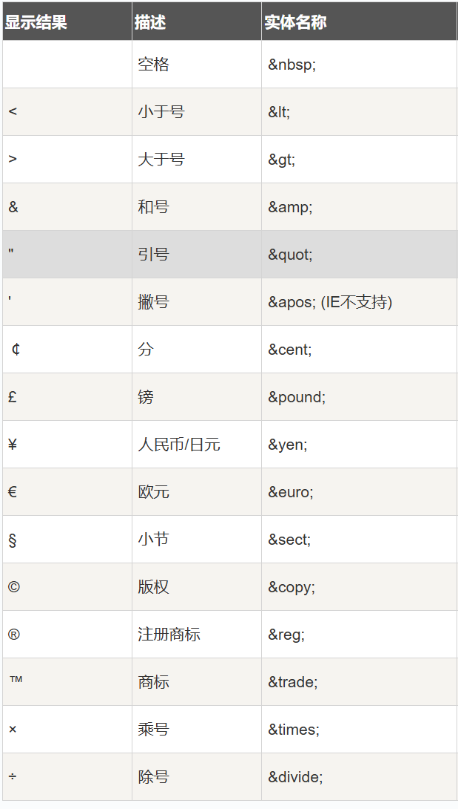

1. <hgroup>：标题组
2. <code>:等宽字体
3. html 解析器：将 HTML 文件转化成 DOM tree：Document Object Model(文档对象模型)
4. HTML 文件>0/1 字节流（编码方式 UTF-8）>字符 tags>DOM 树（link->css,script->js）
5. <pre>:按源文件格式展示
6.  :换行
7. element(元素):<h1>中间内容<h1>
8. attribute(属性):
9. 例：global attribute(accessible to all tags)
10. id=""
11. class
12. style
13. title(提示文本，鼠标放在上面会有文字)
14. draggable(是否可拖拽)
15. 实体引用
16. 例：&nbsp:空格
17. &lt:小于号
18. HTML 常用实体字符
    
ARIA:Accessible Rich Internet Application(无障碍富互联网应用规范)
1. 强化语义，提升对残障用户的友好度
2. 例：<button>==

